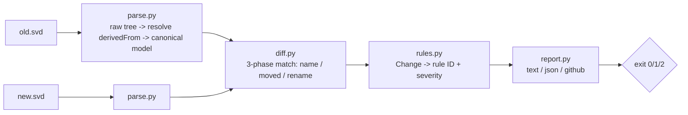

# Architecture

regdrift must never produce a clean diff when a compatibility-relevant
contract changed — every design choice below serves that.

| Module | Responsibility |
| --- | --- |
| `model.py` | The canonical Device/Peripheral/Register/Field/EnumeratedValue dataclasses that both parse.py and diff.py speak. |
| `parse.py` | Parses SVD XML into a raw tree, resolves `derivedFrom` (forward refs, cycles), then builds the fully-cascaded canonical model. |
| `diff.py` | Structurally compares two canonical devices: exact-name match, moved detection, then a rename heuristic on leftovers. |
| `rules.py` | Classifies each `Change` into a `Finding`: rule ID, severity, and a rendered message, per RULES.md. |
| `config.py` | Loads `.regdrift.toml` (allowlist entries and `[severity]` overrides). |
| `report.py` | Renders findings as the ranked text report, schema-versioned JSON, or capped GitHub annotations. |
| `cli.py` | The `regdrift` command group (`parse`, `diff`, `check`) wiring the above together. |

## Testing strategy

- Per-feature unit tests for parsing and diffing behavior.
- Corpus assertions against real vendor SVDs, spot-checked against public datasheets.
- A mutation harness with a rule-coverage gate: every rule ID must be triggered by at least one mutation across the vendor corpus.
- Golden snapshots of resolved output, plus fuzz testing for parser robustness.
- A perf floor test so the tool doesn't quietly regress into unusable.
